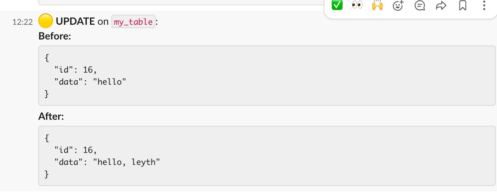

# sql-trigger-slack

A PostgreSQL trigger that sends database changes to Slack in real-time.

## Setup

1. Configure PostgreSQL with audit triggers
2. Set up Slack webhook
3. Run the Python notification service